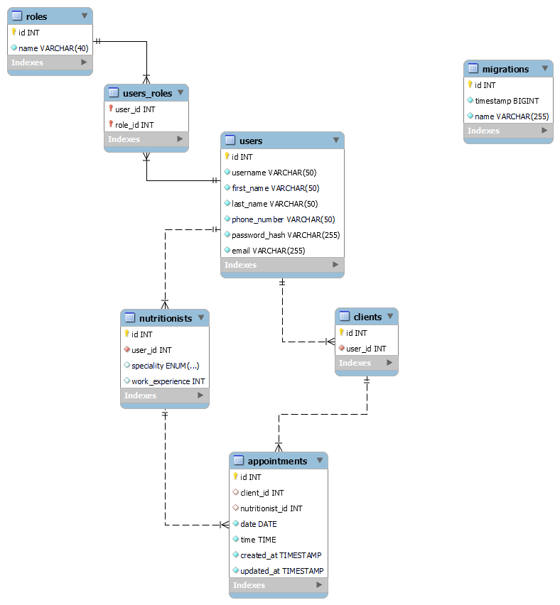

# NUTRIFIT API REST

<details>
  <summary>Contenido 📝</summary>
  <ol>
    <li><a href="#objetivo">Objetivo</a></li>
    <li><a href="#sobre-el-proyecto">Sobre el proyecto</a></li>
    <li><a href="#stack">Stack</a></li>
    <li><a href="#diagrama-bd">Diagrama</a></li>
    <li><a href="#instalación-en-local">Instalación</a></li>
    <li><a href="#endpoints">Endpoints</a></li>
    <li><a href="#futuras-funcionalidades">Futuras funcionalidades</a></li>
    <li><a href="#contribuciones">Contribuciones</a></li>
    <li><a href="#licencia">Licencia</a></li>
    <li><a href="#webgrafia">Webgrafia</a></li>
    <li><a href="#desarrollo">Desarrollo</a></li>
    <li><a href="#agradecimientos">Agradecimientos</a></li>
    <li><a href="#contacto">Contacto</a></li>
  </ol>
</details>

## Objetivo

Este proyecto constituye una API funcional en TypeORM conectada a una base de datos SQL y al frontal que estoy desarrollando en React https://github.com/albertomargut/NutriFit-React.git

## Sobre el proyecto

Mi proyecto consiste en una pagina web que ofrece una solución integral para conectar a los clientes con nutricionistas calificados, facilitando la programación de citas y mejorando la accesibilidad a los servicios de salud y bienestar nutricional. Con la función de planes nutricionales en desarrollo, la plataforma también tiene como objetivo proporcionar un valor añadido al ofrecer recursos prácticos y personalizados para mejorar la salud y el estilo de vida de los usuarios.


## Stack

Tecnologías utilizadas:

- SQL/MySQL
- EXPRESS
- DOCKER
- NODE.JS
- TYPESCRIPT
- TYPEORM

## Diagrama BD



## Instalación en local

1. Clonar el repositorio
2. ` $ npm install `
3. Conectamos nuestro repositorio con la base de datos 
4. Ejecutamos las migraciones con el siguiente comando: '$ npm run db:migrate'
5. Ejecutamos los seeders con el siguiente comando: '$ npm run db:seed'
6. Conectamos el terminal con el servidor con el siguiente comando: '$ npm run dev'
7. Para vaciar las tablas que tenemos para volver a generar las migraciones y los seeders, usamos el siguiente comando: '$ npm run db:refresh'


## Endpoints

<details>
<summary>Endpoints</summary>

-
- REGISTER

            POST http://localhost:3000/auth/register
        body:
        ``` js
            {
                "username": "pruebaCliente6",
                "first_name": "Cliente6",
                "last_name":"Pérez5",
                "email": "cliente6.demo@example.com",
                "password": "12345678",
                "phone_number": "646557606"
            }
        ```
- CREATE USER

            POST http://localhost:3000/api/users/
        body:
        ``` js
            {
                "username": "pruebaCliente6",
                "first_name": "Cliente6",
                "last_name":"Pérez5",
                "email": "cliente6.demo@example.com",
                "password_hash": "12345678",
                "phone_number": "646557606"
            }
        ```
 - CREATE ARTIST

            POST http://localhost:3000/api/users/CreateArtist
        body:
        ``` js
            {
                "username": "pruebaArtist",
                "first_name": "Artist",
                "last_name":"Perez",
                "email": "artist.demo@example.com",
                "password": "12345678",
                "phone_number": "646557606",
                "speciality": "Nutricionista Deportivo" | "Nutricionista Clínico" |"Dietista"; (Hay tres opciones)
                "work_experience": "2"
            }


- LOGIN

            POST http://localhost:3000/auth/login
            
        body:
        ``` js
            {
                
                "email": "cliente6.demo@example.com",
                "password": "12345678"

            }
        ```
- USER PROFILE

            GET http://localhost:3000/api/users/24 

- ALL USERS PROFILES

            GET http://localhost:3000/api/users?page=1&skip=20              
       
- UPDATE PROFILE (ARTIST Y CLIENT)

            PATCH http://localhost:3000/api/users/24 (id)
        body:
        ``` js
            {
                "username" : "alberto.martin",
                "first_name": "Alberto",
                "last_name": "Martin",
                "email" : "alberto.nuevo@example.com"
            }
        ```
- DELETE PROFILE (ARTIST Y CLIENT)

            DELETE http://localhost:3000/api/users/2
        body:
        ``` js
            {
                "username" : "alberto.martin",
                "first_name": "Alberto",
                "last_name": "Martin",
                "email" : "alberto.nuevo@example.com"
            }
        ```    
- APPOINTMENT CREATION

            POST http://localhost:3000/appointments/NewAppointment 
        body:
        ``` js
             {

                "client_id": 5,
                "appointment_date": "2024-02-18 20:30:00" 
            
            }
        ```
        
- APPOINTMENT UPDATE

            PATCH http://localhost:3000/appointments/UpdateAppointment/1
        body:
        ``` js
            {

                "id": 1,
                "client_id": 5,
                "artist_id": 9,
                "appointment_date": "2024-02-18 20:30:00"
            
            }
        ```
- APPOINTMENT DELETE

            DELETE http://localhost:3000/appointments/DeleteAppointment/1 (id)

- APPOINTMENT FOR USERS

            GET http://localhost:3000/appointments/1 (client_id)

- APPOINTMENT FOR NUTRITIONIST

            GET http://localhost:3000/appointments/artists/1 (artist_id)


</details>

## Futuras funcionalidades

[ ] CREACION DE PLANES NUTRICIONALES
[ ] ...
[ ] ...

## Contribuciones

Las sugerencias y aportaciones son siempre bienvenidas.

Puedes hacerlo de dos maneras:

1. Abriendo una issue
2. Crea un fork del repositorio
   - Crea una nueva rama
     ```
     $ git checkout -b feature/nombreUsuario-mejora
     ```
   - Haz un commit con tus cambios
     ```
     $ git commit -m 'feat: mejora X cosa'
     ```
   - Haz push a la rama
     ```
     $ git push origin feature/nombreUsuario-mejora
     ```
   - Abre una solicitud de Pull Request

## Licencia

Este proyecto se encuentra bajo licencia de "Alberto Martín"

## Webgrafia:

Para conseguir mi objetivo he recopilado información de:
- Documentacion propia del curso GeeksHubs junto con las sesiones grabadas.
- Documentacion propia de TypeOrm
- https://www.npmjs.com/package//typeorm

## Desarrollo:

```js
const developer = "Alberto";

console.log("Desarrollado por: Alberto Martín" + developer);
```

## Agradecimientos:

Agradezco a mis compañeros el tiempo dedicado a este proyecto:

- **Todos mis profesores y compañeros que me han acompañado en este proceso**


## Contacto

<a href = "alberto.martinguti@gmail.com"></a>